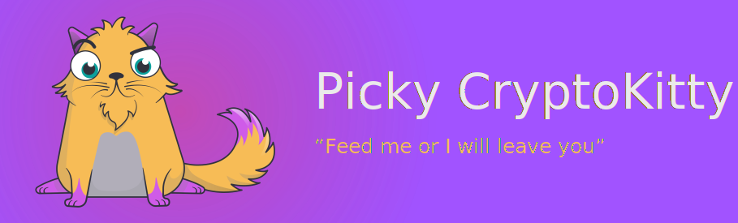

Demo project meant to demonstrate capabilites of Flow. PickyCryptokitty is decentralized application or dapp built with Cadence and lives on the flow network. Backend is built using node.js and minimialistic client with only js/jquery for its simplicity. 


### View Project Video :tada:
[](https://player.vimeo.com/video/507129273)

Better quality video: https://files.fm/f/dze8qdezs#

## Architecture :smiley_cat:

### API
Api is implemented using nodejs and exposes a simple rest api for interaction with backend services. There are few api endpoints needed:
* Mint new tokens  `POST /tokens` We use this endpoint to mint new fungible tokens (tuna tokens) and send them to the wallet `address` that is provided with the request
* Mint new kitten `POST /kittens` This endpoint mint a new kitten and is used in the account setup so the user receives a kitten to the `address` provided in the request
* Get all Cadence interaction scripts `GET /flow` This endpoint returns all the interaction scripts such as `transactions` and `scripts` to the client replaced with already deployed addresses of contracts for the client to be able to use this interactions in the client side.

### Client
Very simplistic and minimal client built with only POJO and jQuery. It is also built and composed using parcel. Client reuses all the funcionality for the interaction with flow from the flow module so there is no code duplication on the front-end or at least minimal.

### Flow
Flow is a internal library to simplify interactions with flow blockchain and to allow client to reuse a lot of functionality from backend. It is divided into:
* **lib** This contains account class which is meant to be a single point of interaction for the account. Once you create account you can call `sendScript` or `sendTransaction` on it or even get balance. It allows very simple usage:
```
  // initialize an empty account
  let accountJoe = deployer.getAccount({});

  // create a new address and assigns keys with our account
  accountJoe = await accountJoe.create({
    proposer: mainAccount,
    payer: mainAccount,
    authorizations: [mainAccount]
  });

  // get balance
  accountJoe.getBalance();

  // get address
  accountJoe.getAddress();

  // send transaction
  await accountJoe.sendTransaction({
    transaction: deployer.getTransaction('setup_account_kitty'),
    args: [],
    proposer: accountJoe,
    payer: mainAccount,
    authorizations: [accountJoe]
  });
```

Service is meant to include funcionality related to our domain such as `mintKittens` or `mintTokens` thus allowing us to reuse code on the backend and frontend.

* **migrations** Migration contains `deployer`service which was built to allow simple deployment of contracts. It allows us to load files from `cadance` module and deploy them to flow blockcahin. Before deployment it replaces all the internal references to other contracts with already deployed addresses and stores all the addresses which allows us to get accounts for the contract at a later time. Example of usage:
```
  // deploy a contract and replace addresses
  await deployer.createAccountAndDeploy(
    'Kitty', 
    mainAccount
  );

  // simply get account for any deployed contract
  deployer.getAccountWithContract('Kitty');

  // simple way to get any interaction files from cadence already replaced by current addresses
  deployer.getTransaction('check_kitten');

```


### Cadence :smiley_cat:
Here are stored `contracts`, `transactions` and `scripts` files for us to deploy to flow and use to interact with contracts.


### Config :smiley_cat:
Configuration place for the project.


## Next Steps :smiley_cat:
This project can be extended to multiple food tokens each having their own percentage of success for a cat to actually eat them.

